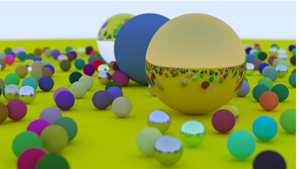

## RustRT

Ray tracer in rust. Based on [Ray Tracing In One Weekend](https://raytracing.github.io/) and [PBRT](https://www.pbr-book.org/3ed-2018/contents).

# Renders

# TODO

- [x] Material
- [ ] Volumetric
- [ ] Bidirectional path tracing
- [ ] Metropolis Light Transport
- [ ] Better sampler